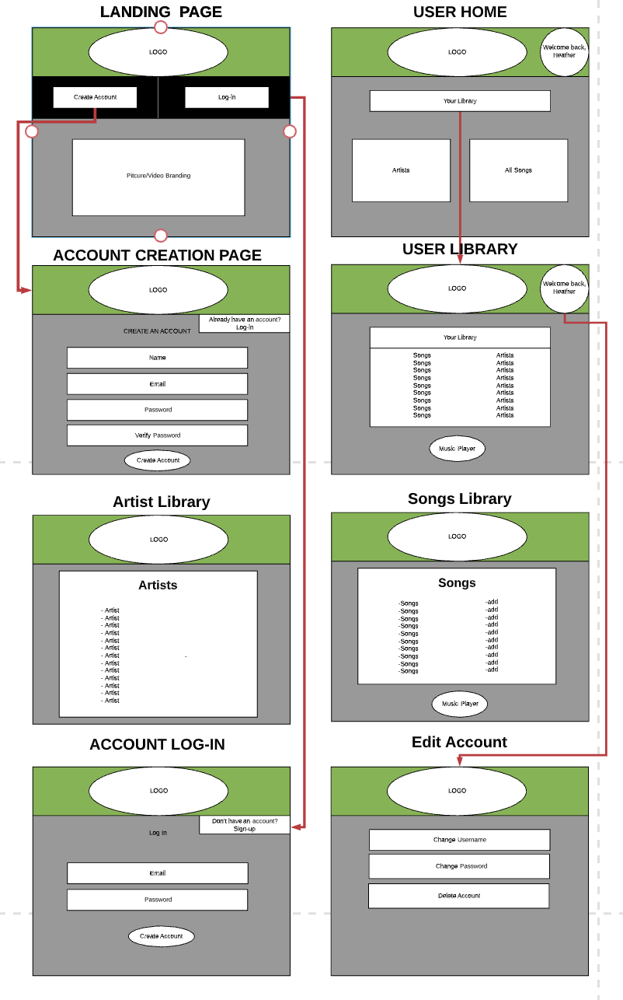
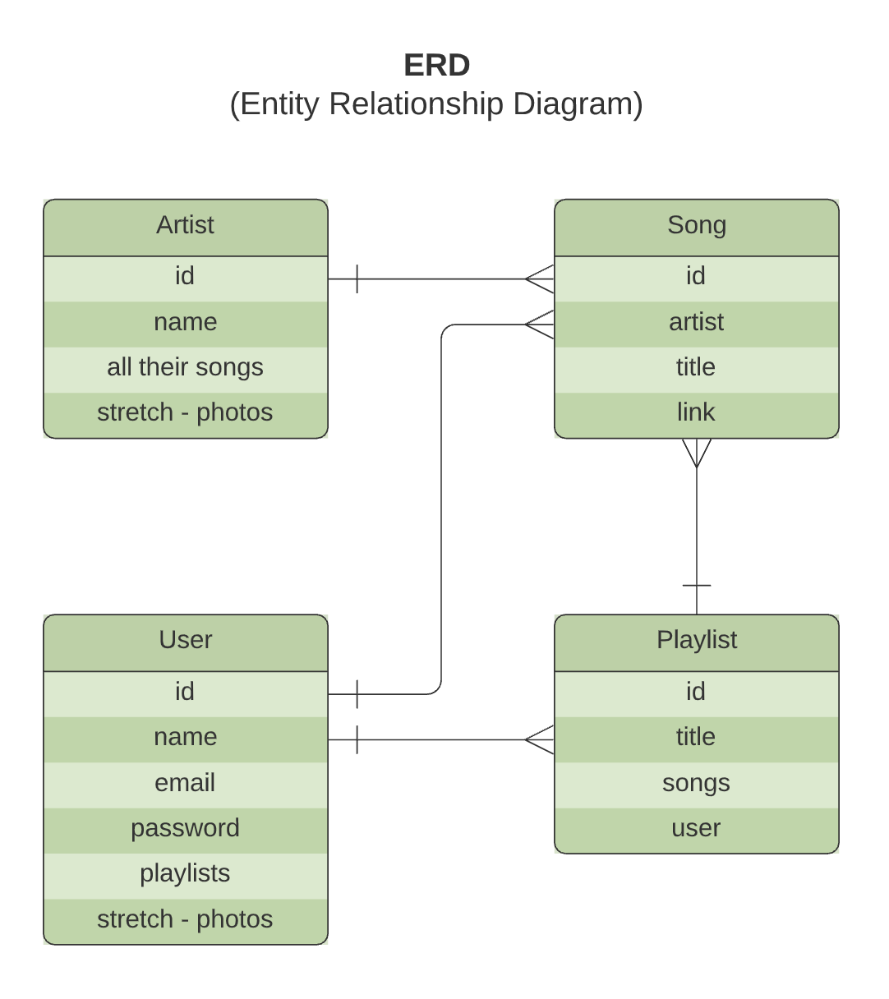

# **NOTify**

## Wireframe -

## ERD -

## Scope -

NOTify will allow users to create an account and sign in to listen to music and create personal playlists. 

## User Story -

Users will be able to create an account and log into their personal music library.
If user clicks on the create account button they will be directed to a create account page. There they will be asked to fill in their name, email, and create a password into a form. Once the user has created a password they will log in and they will be directed to their personal music library.
If a user already has an account they can click on the Log in button and they will be able to log in and directed to their personal music library.
From the home page, users can see all buttons that list all available music artists, and all available songs. If they click the button and navigate to the “Artist” page, they will see a list of all artists. If they click on any artist, that will bring up a list of all the songs we have by that artist. The songs can all be played from this page.
If the user clicks on the song page instead, it will open a list of all the songs available. Here the songs are also playable. Also, the users can click on any artist of a song, and be taken to their artist page, which lists all that artist’s songs.
Users also have the option to save songs anywhere there are songs. If the user saves a song, it will be in their ‘User Library’. The user library can be accessed from the ‘User Home’, which is shown  on log-in, or by clicking a user avatar in the top right.

## Milestones -

### Monday - June 1 (and before)
- Set up server and controllers
- Create models
- Create routes and ejs pages

### Tuesday - June 2
- Populate ejs pages with all necessary info
- Link all the pages to each other
- Work on auth

### Wednesday - June 3
- styling
- add audio player to necesary pages
- add audio files

### Thursday - June 4
- styling
- stretch goals

## Stretch Goals -
- adding photos to user profiles
- adding photos to artist pages
- Making playlists saved specifically to user accounts
- Stying the pages with songs to display as a table with grid

## 3 Lines of Code -
- Three lines of code we'd like to share:

This is from login route for user:
if (!foundUser) {
        return res.render('users/login',{ message: "Incorrect e-mail, or user does not exist." });
    }

This is in the login ejs, to display the message:
<% if (message) { %>
            
<%= message%>

            <% } %>

- This is how we notify our users if they enter an incorrect email on the log-in screen.
